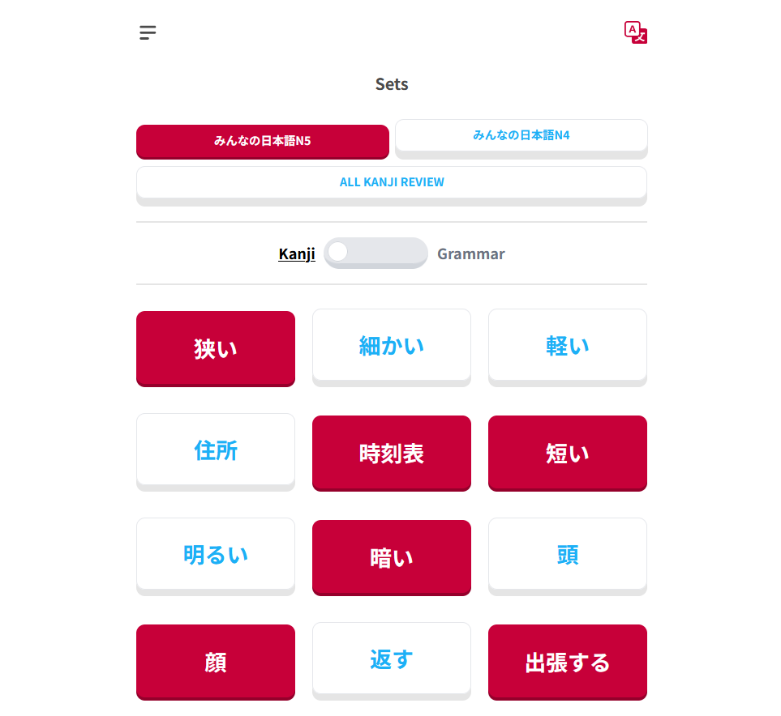

# Japanese language Flashcards

Flashcards-JP is a Japanese learning website designed to help users learn Kanji and grammar points effectively. Built using Next.js, the platform offers an interactive experience to enhance Japanese language skills.

## Features

    Kanji Learning: Study Kanji with readings and meanings.
    Grammar Points: Learn essential grammar structures with explanations and examples. [Changed to Lithuanian language]
    Flashcards: Interactive flashcards to reinforce learning.

## Prerequisites

Ensure you have Node.js installed.

## Installation

**1) Clone the repository.**

**2) Install dependencies:**

    npm install  # or yarn install or pnpm install or bun install

**3) Start the development server:**

    npm run dev  # or yarn dev or pnpm dev or bun dev

Open http://localhost:3000 in your browser to view the website.

## Deployment

The easiest way to deploy this Next.js app is using Vercel. Follow the Next.js deployment guide for more details.

## Technologies Used

    Next.js - React framework for server-side rendering and static site generation.
    Tailwind CSS - Utility-first CSS framework for styling.

## Screenshots & Demo
* Flashcard Face 1:

* Flashcard Face 2:

* Learn page:

* Sets page:

## Contributing

Contributions are welcome! Feel free to submit issues or pull requests to improve the project.
